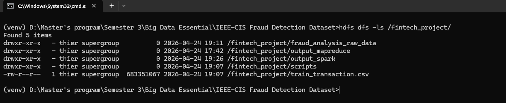
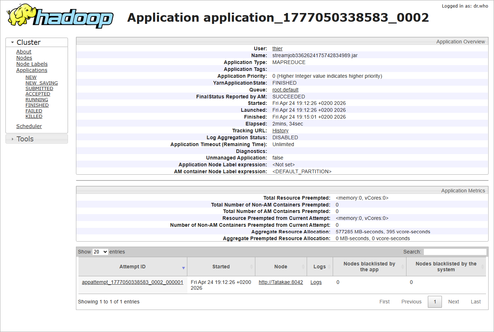
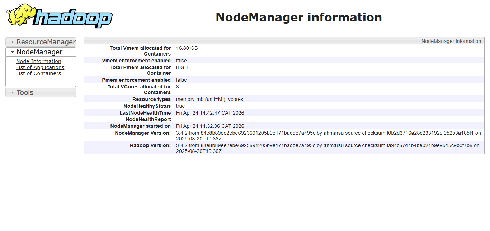
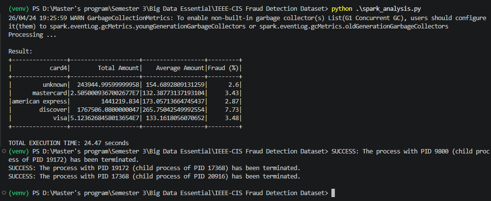

# Comparative Study: Hadoop MapReduce vs. Apache Spark

[](https://github.com/Elthiero/fintech-hadoop-spark-comparison.git)

This repository contains a Master's level comparative study evaluating the performance, complexity, and architectural differences between **Apache Hadoop (MapReduce)** and **Apache Spark (PySpark)**.

The project processes a real-world financial dataset to aggregate transaction volumes, calculate average transaction sizes, and profile fraud rates across major credit card networks utilizing a **"Schema-on-Read"** data ingestion strategy.

## Academic Context

* **Course:** Big Data Essential
* **Lecturer:** Kundan Kumar

---

## Dataset Overview

This project processes the raw **IEEE-CIS Fraud Detection** dataset (originally provided by Vesta Corporation). The dataset consists of real-world e-commerce transactions provided by Vesta Corporation, a leader in guaranteed payment solutions. It is designed for benchmarking machine learning models in high-stakes fraud prevention.

* **Target File:** `train_transaction.csv`
* **File Size:** ~667 MB
* **Dimensions:** 590,540 rows × 394 columns
* **Target Features Extracted:** `card4`, `TransactionAmt`, `isFraud`
* **LINK:** [IEEE-CIS Fraud Detection]([URL](https://www.kaggle.com/c/ieee-fraud-detection/data))

---

## Project Structure

```text
├── data/
│   └── train_transaction.csv   # Original raw dataset (ignored in git)
├── screenshots/                # Execution logs and UI dashboards
│   ├── directories.png
│   ├── mapreduce_info.png
│   ├── nodeinfo.png
│   └── pyspark.png
├── .gitignore
├── README.md
├── cleaned_dataset.csv
├── guidelines.md               # Project rubric
├── mapper.py                   # MapReduce: Python Mapper
├── reducer.py                  # MapReduce: Python Reducer
├── requirements.txt
└── spark_analysis.py           # Spark: PySpark DataFrame implementation
```

---

## Execution Guide

### Prerequisites

* **Java 8 or 17** (`JAVA_HOME` configured)
* **Hadoop 3.x** (`HADOOP_HOME` configured, running locally on port 9000)
* **Apache Spark 3.x** (`SPARK_HOME` configured)
* **Python 3.12** (with `pyspark` and `findspark` installed)
* **Requirements.txt** packages.

### 1. Clone the Repository

```bash
git clone [https://github.com/Elthiero/fintech-hadoop-spark-comparison.git](https://github.com/Elthiero/fintech-hadoop-spark-comparison.git)
cd fintech-hadoop-spark-comparison
```

After cloning, add the extract file `train_transaction.csv` to `fintech-hadoop-spark-comparison/data`. **link:** [IEEE-CIS Fraud Detection](https://www.kaggle.com/c/ieee-fraud-detection/data)

### 2. Running the MapReduce Job (Hadoop Streaming)

*Note: Ensure the raw data is uploaded to HDFS at `/fintech_project/train_transaction.csv`, and your hadoop services are running.*

```cmd
hdfs dfs -mkdir /fintech_project
hdfs dfs -mkdir /fintech_project/scripts
hdfs dfs -mkdir /fintech_project/output_spark

hdfs dfs -put data/train_transaction.csv /fintech_project/
hdfs dfs -put mapper.py /fintech_project/scripts/
hdfs dfs -put reducer.py /fintech_project/scripts/
```

```cmd
hadoop jar C:\hadoop\share\hadoop\tools\lib\hadoop-streaming-*.jar ^
  -files "hdfs:///fintech_project/scripts/mapper.py,hdfs:///fintech_project/scripts/reducer.py" ^
  -mapper "C:\Users\thier\AppData\Local\Programs\Python\Python312\python.exe mapper.py" ^
  -reducer "C:\Users\thier\AppData\Local\Programs\Python\Python312\python.exe reducer.py" ^
  -input /fintech_project/train_transaction.csv ^
  -output /fintech_project/fraud_analysis_raw_data
```

To see the output:

```cmd
hdfs dfs -cat /fintech_project/fraud_analysis_raw_data/part-00000
```

### 3. Running the Apache Spark Job

```cmd
python spark_analysis.py
```

---

## Benchmark Results

Both frameworks processed the **raw 667 MB dataset (394 columns)** directly from HDFS to calculate the total transaction amount, average transaction size, and fraud percentage grouped by card network.

| Framework | Architecture | Execution Time |
| :--- | :--- | :--- |
| **Hadoop MapReduce** | Disk-based (I/O heavy) | **154.00 seconds** (2m 34s) |
| **Apache Spark** | In-Memory (DAG execution) | **24.47 seconds** |

### Key Insights

1. **Performance:** Apache Spark outperformed Hadoop MapReduce by a factor of **~6.3x** by caching the dataset in memory and minimizing disk read/write bottlenecks during the shuffle phase.
2. **Parsing Robustness:** The MapReduce implementation required manual schema extraction and suffered from data loss when naive Python `.split(',')` logic encountered text fields with internal commas. PySpark's native enterprise CSV parser flawlessly navigated complex text fields, correctly capturing the full \$51.2M volume for Visa without dropping rows.

### Screenshots





